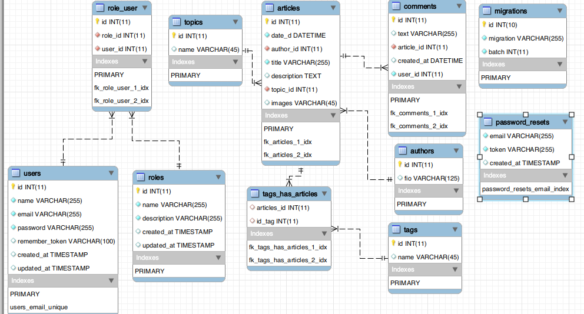

# Database Blog

Blog database

> How to use it

On the command line  run this command
 
## Example (Optional)
```bash
mysqldump -u USER -pPASSWORD DATABASE > /path/to/file/<filename>.sql
```

---
- Database use this structure
---

[]()


